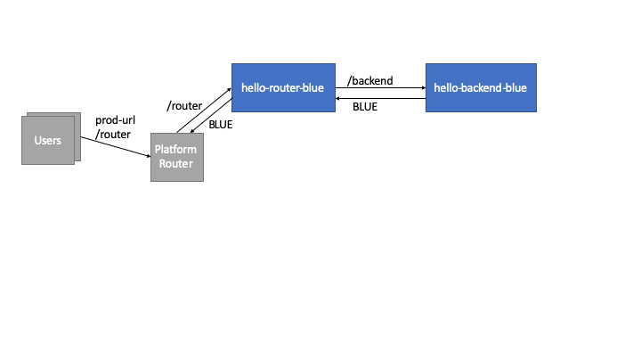
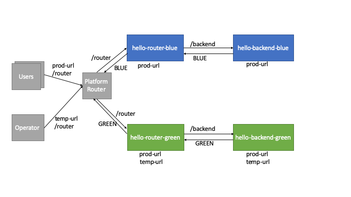
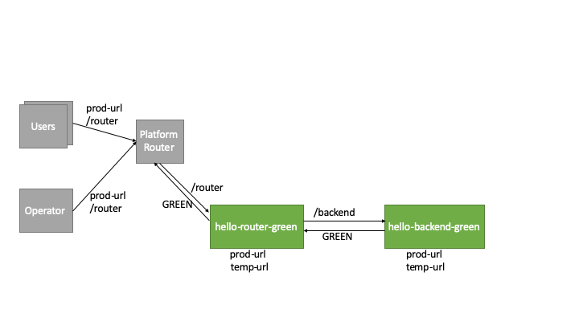

:toc:
# Legacy Blue-Green Deployment

Blue-green deployment is a technique that reduces downtime and risk by running two identical production environments called Blue and Green.

At any time, only one of the environments is live, with the live environment serving all production traffic. For this example, Blue is currently live and Green is idle.

As you prepare a new version of your software, deployment and the final stage of testing takes place in the environment that is not live: in this example, Green. Once you have deployed and fully tested the software in Green, you switch the router so all incoming requests now go to Green instead of Blue. Green is now live, and Blue is idle.

This technique can eliminate downtime due to app deployment. In addition, blue-green deployment reduces risk: if something unexpected happens with your new version on Green, you can immediately roll back to the last version by switching back to Blue.

The example will demonstrate how to acomplish blue-green deployment using MTA.

MTA blue-green deployment is separeted in two phases. 
First phase, so called validation is phase setup the next color environment, in order to be tested. The new environment version, in this case GREEN, is not accessible on the production routes but on temporary `-idle` routes. The validation phase is used to verify that new version of environment is operational.

During second phase all new applications are assigned to production routes and the new MTA color become productive.

## Requirements
* Awarenes of blue green deploy in Cloud Foundry: link:https://docs.cloudfoundry.org/devguide/deploy-apps/blue-green.html[Using Blue-Green Deployment to Reduce Downtime and Risk]

## Official documemtation
* SAP Help Portal: link:https://help.sap.com/viewer/65de2977205c403bbc107264b8eccf4b/Cloud/en-US/764308c52e68488dac848bae93e9137b.html[Legacy Blue-Green Deployment]

# Try out

The example will demonstrate blue-green deployment of one MTA comprised of two applications. The first applcation, called "hello-backend", serves as backend and the second one, called "hello-router", serves as front end. 

The idea is to have sample MTA which seems very similar to standard business applications that are comprised of frontend, backend and backing services. In the example "hello-backend" will play the combined role between backend and backing services, where the customer data is stored.

In terms of the example, we are using Java applications which communicate using REST interface. Both applications are simple web projects containing only one servlet. 

.Applications REST endpoints and logic
|===
|Application Color |hello-router |hello-backend 

|blue
|GET /router -> calls <hello-backend>/backend
|GET /backend -> returns BLUE

|green
|GET /router -> calls <hello-backend>/backend
|GET /backend -> returns GREEN
|===

## Execute initial blue-green deployment of the BLUE environment

Initial blue green deployment is very similar to standard deployment because there are not existing applications. One difference is that temporary routes will be added during the deployment. Finally, the standard routes are assigned to the applications.

In the end of this part, you wil have similar environment:


### Deploy

You can try 3 different approaches, that will lead to the same result and the same output during the deployment.
The differences are how the deploymnet is trigger.

#### Using existing .mtar
```bash
  $ cf bg-deploy hello-blue/hello.mtar -f
  ...
  No deployed MTA detected - this is initial deployment
  New MTA color: BLUE
  ...
  Starting application "hello-backend-blue"...
  Application "hello-backend-blue" started and available at "<org>-<space>-hello-backend-idle.cfapps.sap.hana.ondemand.com"
  ...
  Starting application "hello-router-blue"...
  Application "hello-router-blue" started and available at "<org>-<space>-i076083-2-hello-router-idle.cfapps.sap.hana.ondemand.com"
  ...
  Application "hello-backend-blue" started and available at "<org>-<space>-hello-backend.cfapps.sap.hana.ondemand.com"
  ...
  Application "hello-router-blue" started and available at "<org>-<space>-hello-router.cfapps.sap.hana.ondemand.com"
```

#### Using deploy from directory with .mtad
The approach will use deployment descriptor `hello-blue/mtad.yaml` and already built application bineries `hello-blue/router.war` and `hello-blue/backend.war`
```bash
  $ cf bg-deploy hello-blue/ -f
```

#### Build and deploy
The approach will use development descriptor `hello-blue/mta.yaml` to build bineries from source code folders `hello-blue/router/` and `hello-blue/backend/`. Then builded MTAR will be deployed.

NOTE: The Cloud MTA Build Tool is usiing maven to build Java applications by default.

```bash
  $ mbt build -p cf -s hello-blue
  ...
  INFO validating the MTA project
  INFO building the "hello-router" module...
  INFO executing the "mvn -B package" command..
  ...
  INFO the build results of the "hello-router" module will be packed and saved in the "/mta_examples/blue-green-deploy/hello-blue/.hello-blue_mta_build_tmp/hello-router" folder
  INFO building the "hello-backend" module...
  INFO executing the "mvn -B package" command...
  ...
  [INFO] BUILD SUCCESS
  [INFO] ------------------------------------------------------------------------
  [INFO] Total time: 1.301 s
  [INFO] Finished at: xxxx
  [INFO] ------------------------------------------------------------------------
  INFO the build results of the "hello-backend" module will be packed and saved in the "/mta_examples/blue-green-deploy/hello-blue/.hello-blue_mta_build_tmp/hello-backend" folder
  INFO generating the metadata...
  INFO generating the MTA archive...
  INFO the MTA archive generated at: /mta_examples/blue-green-deploy/hello-blue/mta_archives/hello_0.1.0.mtar
  $ cf bg-deploy hello-blue/mta_archives/hello_0.1.0.mtar
```
### Examine the result
Verify that front-end `hello-router` returns BLUE:
```bash
  $ curl https://<org>-<space>-hello-router.cfapps.sap.hana.ondemand.com/router
  BLUE
```

## Execute blue-green deployment of the GREEN environment and entering the validation phase

In the end of this part, you wil have similar environment:

image::diagrams/bg-deploy-green-validation.png[]
### Deploy
You can try 3 different approaches, that will lead to the same result

#### Using existing .mtar
```bash
  $ cf bg-deploy hello-green/hello.mtar -f
  ...
  Deployed MTA color: BLUE
  New MTA color: GREEN
  ...
  Starting application "hello-backend-green"...
  Application "hello-backend-green" started and available at "<org>-<space>-hello-backend-idle.cfapps.sap.hana.ondemand.com"
  ...
  Starting application "hello-router-green"...
  Application "hello-router-green" started and available at "<org>-<space>-hello-router-idle.cfapps.sap.hana.ondemand.com"
  Process has entered validation phase. After testing your new deployment you can resume or abort the process.
  Use "cf bg-deploy -i xxxx -a abort" to abort the process.
  Use "cf bg-deploy -i xxxx -a resume" to resume the process.
  Hint: Use the '--no-confirm' option of the bg-deploy command to skip this phase.
```

#### Using deploy from directory with .mtad
The approach will use deployment descriptor `hello-green/mtad.yaml` and already built application bineries `hello-green/router.war` and `hello-green/backend.war`
```bash
  $ cf bg-deploy hello-green/ -f
```

#### Build and deploy
The approach will use development descriptor `hello-green/mta.yaml` to build bineries from source code folders `hello-green/router/` and `hello-green/backend/`. Then builded MTAR will be deployed.
```bash
  $ mbt build -p cf -s hello-blue
  $ cf bg-deploy hello-blue/mta_archives/hello_0.1.0.mtar
```

### Examine the result
Verify that both application version are now available
```bash
  $ cf a
Getting apps in org xxx / space xxx as xxx...
OK

name                  requested state   instances   memory   disk   urls
hello-router-blue     started           1/1         512M     256M   <org>-<space>-hello-router.cfapps.sap.hana.ondemand.com
hello-backend-green   started           1/1         512M     256M   <org>-<space>-hello-backend-idle.cfapps.sap.hana.ondemand.com
hello-router-green    started           1/1         512M     256M   <org>-<space>-hello-router-idle.cfapps.sap.hana.ondemand.com
hello-backend-blue    started           1/1         512M     256M   <org>-<space>-hello-backend.cfapps.sap.hana.ondemand.com
```
Verify that BLUE environment is still the productive one:
```bash
  $ curl https://<org>-<space>-hello-router.cfapps.sap.hana.ondemand.com/router
  BLUE
```
Verify that GREEN environment can be accessed and validated on temporary `-idle` routes:
```bash
  $ curl https://<org>-<space>-hello-router-idle.cfapps.sap.hana.ondemand.com/router
  GREEN
```
NOTE: In case of a problem, the bg-deploy can be aborted without influencing the production environment. To stop the process copy-paste the suggested command by MTA CF CLI plugin: `cf bg-deploy -i xxxx -a abort`

## Make GREEN environment the productive one

At some point of time, you wil have similar environment, where both BLUE and GREEN applications are mapped to production routes.



In the end of this part, you wil have similar environment:


```bash
  $ cf bg-deploy -i 1b59ca36-007e-11ea-bbed-eeee0a9e6b19 -a resume
Executing action 'resume' on operation xxxx...
...
Updating application "hello-backend-green"...
Stopping application "hello-backend-green"...
Starting application "hello-backend-green"...
Application "hello-backend-green" started and available at "<org>-<space>-hello-backend.cfapps.sap.hana.ondemand.com"
Publishing publicly provided dependency "hello:backend"...
Publishing publicly provided dependency "hello:hello-backend"...
Deleting discontinued configuration entries for application "hello-backend-green"...
Updating application "hello-router-green"...
Stopping application "hello-router-green"...
Starting application "hello-router-green"...
Application "hello-router-green" started and available at "<org>-<space>-hello-router.cfapps.sap.hana.ondemand.com"
Publishing publicly provided dependency "hello:hello-router"...
Deleting discontinued configuration entries for application "hello-router-green"...
Deleting routes for application "hello-router-blue"...
Deleting routes for application "hello-backend-blue"...
Stopping application "hello-router-blue"...
Deleting application "hello-router-blue"...
Stopping application "hello-backend-blue"...
Deleting application "hello-backend-blue"...
Process finished.
```
### Examine the result
Verify that old BLUE applications are deleted and new GREEN applications are assigned to production routes:
```bash
  $ cf a
Getting apps in org xxx / space xxx as xxx...
OK

name                  requested state   instances   memory   disk   urls
hello-backend-green   started           1/1         512M     256M   <org>-<space>-hello-backend.cfapps.sap.hana.ondemand.com
hello-router-green    started           1/1         512M     256M   <org>-<space>-hello-router.cfapps.sap.hana.ondemand.com
```
Verify that GREEN environent is the production one and serves on the production routes:
```bash
  $ curl https://<org>-<space>-hello-router.cfapps.sap.hana.ondemand.com/router
  GREEN
```
## Execute blue-green deployment of the BLUE environment without confirmation
There is an option to run end-to-end blue-green deployment without user interaction. The option is useful for CI and CD, where one MTA is continuously re-deployed without downtime.

In the end of this part, you wil have similar environment:


```bash
  $ cf bg-deploy hello-blue -f --no-confirm
...
Deployed MTA color: GREEN
New MTA color: BLUE
...
Starting application "hello-backend-blue"...
Application "hello-backend-blue" started and available at "deploy-service-i076083-2-hello-backend-idle.cfapps.sap.hana.ondemand.com"
...
Starting application "hello-router-blue"...
Application "hello-router-blue" started and available at "deploy-service-i076083-2-hello-router-idle.cfapps.sap.hana.ondemand.com"
...
Application "hello-backend-blue" started and available at "deploy-service-i076083-2-hello-backend.cfapps.sap.hana.ondemand.com"
...
Starting application "hello-router-blue"...
Application "hello-router-blue" started and available at "deploy-service-i076083-2-hello-router.cfapps.sap.hana.ondemand.com"
...
Process finished.
Use "cf dmol -i xxx" to download the logs of the process.
```

### Examine the result
Verify that old GREEN applications are deleted and new BLUE applications are assigned to production routes:
```bash
  $ cf a
Getting apps in org xxx / space xxx as xxx...
OK

name                  requested state   instances   memory   disk   urls
hello-backend-blue   started           1/1         512M     256M   <org>-<space>-hello-backend.cfapps.sap.hana.ondemand.com
hello-router-blue    started           1/1         512M     256M   <org>-<space>-hello-router.cfapps.sap.hana.ondemand.com
```
Verify that BLUE environent is the production one and serves on the production routes:
```bash
  $ curl https://<org>-<space>-hello-router.cfapps.sap.hana.ondemand.com/router
  BLUE
```
