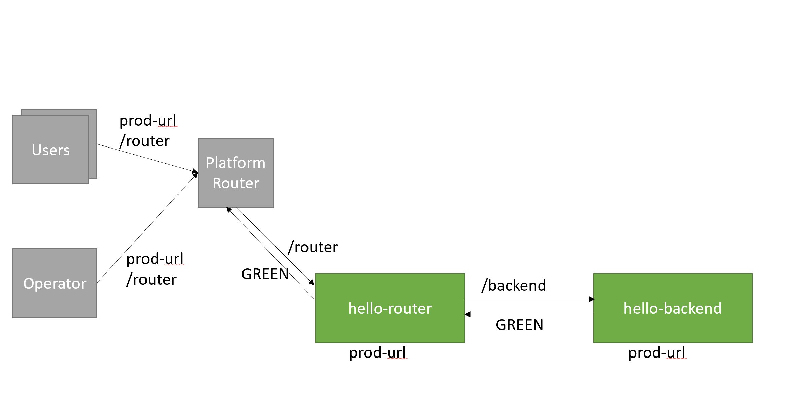

:toc:
# Blue-Green Deployment with incremental-blue-green strategy

## Execute initial deployment

You've already executed a deployment and your live applications are deployed and up and running. The following is an example of an output of a normal non-blue-green deployment.

image::../diagrams/initial-bg-deploy-blue.png[]

#### Deploying a new MTA application
```bash
  $ cf deploy hello.mtar -f
  Deploying multi-target app archive hello.mtar in org xxx / space xxx as xxx...
  Uploading 1 files...
    ./hello-green/hello.mtar
  OK
  Operation ID: xxx
  Deploying in org "xxx" and space "xxx"
  Detected MTA schema version: "3"
  No deployed MTA detected - this is initial deployment
  Detected new MTA version: "0.1.0"
  Creating application "hello-backend" from MTA module "hello-backend"...
  Uploading application "hello-backend"...
  Started async upload of application "hello-backend"
  Scaling application "hello-backend" to "3" instances...
  Staging application "hello-backend"...
  Application "hello-backend" staged
  Starting application "hello-backend"...
  Application "hello-backend" started and available at "<org>-<space>-hello-backend.<domain>"
  Publishing publicly provided dependency "hello:backend"...
  Creating application "hello-router" from MTA module "hello-router"...
  Uploading application "hello-router"...
  Started async upload of application "hello-router"
  Scaling application "hello-router" to "3" instances...
  Staging application "hello-router"...
  Application "hello-router" staged
  Starting application "hello-router"...
  Application "hello-router" started and available at "<org>-<space>-hello-router.<domain>"
  Skipping deletion of services, because the command line option "--delete-services" is not specified.
  Process finished.
  Use "cf dmol -i xxx" to download the logs of the process.```
```

### Examine the result
Verify that the applications are deployed.
```bash
$ cf a
Getting apps in org xxx / space xxx as xxx...
OK

name            requested state   processes   routes
hello-backend   started           web:3/3     <org>-<space>-hello-backend.<domain>
hello-router    started           web:3/3     <org>-<space>-hello-router.<domain>
```

## Incremental Blue-Green Deployment Process

The incremental blue-green deployment strategy ensures a smooth transition between the old and new versions of an application.
During the incremental blue-green deployment, one instance of the live application is stopped and one new instance of the new application is started at a time, until the new application is started on all instances. This strategy ensures a smooth transition between the old and new versions of an application and minimizes the total number of maximum application instances during the deployment process.
The process is as follows:

1. *Initial Setup*: The new version of the application is deployed to only one instance.
2. *Testing Phase*: The new application enters the testing phase, where users or automated systems validate its functionality.
3. *User Acceptance*: Customers or designated testers evaluate the new application.
4. *Deployment Continuation*: Once testing is satisfactory, the deployment process resumes.
5. *Incremental Scaling*:
- The deployment service reduces the old application's instance count by one.
- The new application is scaled up by one instance.
6. *Iteration*: Step 5 is repeated until the new application reaches the required number of instances.
7. *Completion*: After the new application is fully scaled up, the remaining instances of the old application are stopped and removed.

== Key Considerations

.Total Instance Count
- During the incremental blue-green deployment, the total number of instances (old + new) will not exceed `N + 1`, where `N` is the required instance count for the new application.

.Handling Instance Failures
- If an instance crashes during the scaling process, the deployment service will initiate a rollback:
- The old application is scaled back up to its initial instance count.
- The new application is scaled down to one instance.
- This rollback ensures system stability by restoring the state to what it was before the incremental scaling began.

#### Execute the deployment
```bash
cf deploy hello.mtar --strategy incremental-blue-green

Deploying multi-target app archive ./hello-green/hello.mtar in org xxx / space xxx as xxx...

Uploading 1 files...
  ./hello-green/hello.mtar
OK
Operation ID: xxx
Deploying in org "xxx" and space "xxx"
Detected MTA schema version: "3"
Detected deployed MTA with ID "hello" and version "0.1.0"
Renaming application "hello-backend" to "hello-backend-live"...
Renaming application "hello-router" to "hello-router-live"...
Detected new MTA version: "0.1.0"
Deployed MTA version: "0.1.0"
Creating application "hello-backend-idle" from MTA module "hello-backend"...
Uploading application "hello-backend-idle"...
Started async upload of application "hello-backend-idle"
Staging application "hello-backend-idle"...
Application "hello-backend-idle" staged
Starting application "hello-backend-idle"...
Application "hello-backend-idle" started and available at "<org>-<space>-hello-backend-idle.<domain>"
Creating application "hello-router-idle" from MTA module "hello-router"...
Uploading application "hello-router-idle"...
Started async upload of application "hello-router-idle"
Staging application "hello-router-idle"...
Application "hello-router-idle" staged
Starting application "hello-router-idle"...
Application "hello-router-idle" started and available at "<org>-<space>-hello-router-idle.<domain>"
Process has entered testing phase. After testing your new deployment you can resume or abort the process.
Use "cf deploy -i xxx -a abort" to abort the process.
Use "cf deploy -i xxx -a resume" to resume the process.
Hint: Use the "--skip-testing-phase" option of the deploy command to skip this phase.
```

#### Resume the deployment
```bash
Executing action "resume" on operation xxx...
OK
Detected new MTA version: "0.1.0"
Deployed MTA version: "0.1.0"
Updating application "hello-backend-idle"...
Stopping application "hello-backend-idle"...
Starting application "hello-backend-idle"...
Application "hello-backend-idle" started and available at "<org>-<space>-hello-backend.<domain>"
Starting incremental application instance update for "hello-backend-idle"...
Application "hello-backend-idle" started and available at "<org>-<space>-hello-backend.<domain>"
Updating application "hello-router-idle"...
Stopping application "hello-router-idle"...
Starting application "hello-router-idle"...
Application "hello-router-idle" started and available at "<org>-<space>-hello-router.<domain>"
Starting incremental application instance update for "hello-router-idle"...
Application "hello-router-idle" started and available at "<org>-<space>-hello-router.<domain>"
Renaming application "hello-backend-idle" to "hello-backend"...
Renaming application "hello-router-idle" to "hello-router"...
Deleting routes for application "hello-backend-live"...
Route "<org>-<space>-hello-backend.cfapps.sap.hana.ondemand.com" not deleted since it is in use
Stopping application "hello-backend-live"...
Deleting application "hello-backend-live"...
Deleting routes for application "hello-router-live"...
Route "<org>-<space>-hello-router.cfapps.sap.hana.ondemand.com" not deleted since it is in use
Stopping application "hello-router-live"...
Deleting application "hello-router-live"...
Skipping deletion of services, because the command line option "--delete-services" is not specified.
Process finished.
Use "cf dmol -i a1c129dc-5fa8-11ef-8582-eeee0a83bec1" to download the logs of the process.
```

At some point in time, you will have a similar environment, where both IDLE and LIVE applications are mapped to productive routes.

image::../diagrams/bg-deploy-green-temp.png[]

After that the already deployed (old) applications routes are unmapped and the applications get deleted.



### Examine the result
Verify that old applications are deleted and new applications are assigned to production routes:
```bash
$ cf a
Getting apps in org xxx / space xxx as xxx...
OK

name            requested state   processes   routes
hello-backend   started           web:3/3     <org>-<space>-hello-backend.<domain>
hello-router    started           web:3/3     <org>-<space>-hello-router.<domain>
```
