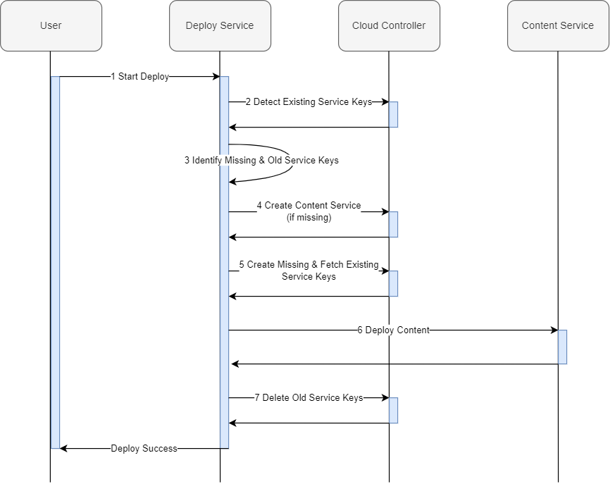

:toc:

# Recreating Service Keys During Content Deployment

## Overview

This is an extension of the existing content deployment modeling.

During deployment a number of service keys are used either for retrieving credentials, a content endpoint from the content service instance or any number or required configurations from other service instances (depending on the content service implementation). These service keys could previously be customized (see Content Deployment documentation linked below) but not recreated easily as part of the deployment process. Since regular rotation of credentials is a reasonable security requirement we now support this scenario. We provide a way to specify that a service key should be recreated for each new content deployment (creating a new one and deleting the one from the previous deployment after successfully finishing).

This is an overview of the rotation process:



More detailed explanation:

1. A user starts the deploy process, passing a `mtad.yaml` descriptor containing a module of type `com.sap.application.content` indicating content deploy. For example - a single content module and multiple required services, only one of which is marked as the content service with parameter `content-target: true`.
2. Deploy Service detects the services and service keys part of the MTA that already exist in the target space and org via names and metadata. This includes the content service and any other services required for the deployment.
3. Deploy Service calculates the service keys that are required for the deployment from the `mtad.yaml` modeling. This includes service keys that are explicitly defined and ones that are implied, following the `${moduleName}-${resourceName}-credentials` naming convention. It then compares the calculated keys to the existing ones detected in the previous step. Any required keys that do not existing will be created during deploy. The existing non-required keys will be deleted after the successful deploy.
4. Deploy Service creates the content service if necessary (in the case of first deploy)
5. Deploy Service creates all missing service keys and fetches existing keys' credentials (as part of the content service's credentials there is a `content_endpoint` parameter, used for the content deploy)
6. Deploy Service performs the content deploy - making calls to the content_endpoint and passing service keys' credentials as configuration
7. After successful content deploy, Deploy Service deletes the existing service keys that weren't part of the MTA model in mtad.yaml (assuming keys were part of old deployment)

## Manual Modeling

Since the recreation mechanism works by comparing the keys by name, all implicit service keys will be reused, keeping existing behaviour in place. Any explicitly named service keys in mtad.yaml that were manually renamed in descriptor will be recreated. For explicit service keys, you can either use the `service-key` parameter in the required section or use an `existing-service-key` typed resource. E.g.

```yaml
...
modules:
  - name: my-destination-content
    type: com.sap.application.content
    requires:
      - name: my_destination_service
        parameters:
          content-target: true
          service-key:
            name: my-destination-service-key
            config:
              <configuration>
      - name: my-additional-service-key
...
resources:
  - name: my-additional-service-key
    type: org.cloudfoundry.existing-service-key
    config:
      <configuration>
...
```

## Automated Modeling

To use a more automated way of flagging a service key for recreation without the need for manual renaming you can use the system parameter `${timestamp}` as part of its name. This ensures that key will be unique at time of deployment and considered a new key, while the older one will be detected and deleted (the deletion happens after the new one is created and content deplpoyment finished so as not to invalidate any credentials in use). The parameter `${timestamp}` is resolved to the current timestamp when the MTA module is processed in the beginning of the MTA deployment.

Example of this modeling (also used in the provided example mtar descriptor)
```yaml
...
modules:
  - name: my-destination-content
    type: com.sap.application.content
    requires:
      - name: my_destination_service
        parameters:
          content-target: true
          service-key:
            name: destination-service-key-${timestamp}
            config:
              <configuration>
...
```
## Try it out

Deploy the provided mtar in cf to demo the automated service key rotation
```bash
cf deploy ./test-destination-gacd-x509.mtar
```

Verify the destination service key that was created
```bash
cf service-keys my_destination_service
...
cf service-key my_destination_service <service-key-name-timestamp1>
...
```

Do a redeploy of the same mta (observe the messages in the process log), e.g.
```bash
cf deploy ./test-destination-gacd-x509.mtar
...
Creating service key "<service-key-name-timestamp2>" for service "my_destination_service"...
...
Deleting old service keys for content deploy "[<service-key-name-timestamp1>]"...
...
```

Verify the destination service key that was created
```bash
cf service-keys my_destination_service
...
cf service-key my_destination_service <service-key-name-timestamp2>
...
```

## Official related documemtation in Help SAP Portal

- link:https://help.sap.com/viewer/65de2977205c403bbc107264b8eccf4b/Cloud/en-US/d3e23196166b443db17b3545c912dfc0.html[Content Deployment]
- link:https://help.sap.com/viewer/65de2977205c403bbc107264b8eccf4b/Cloud/en-US/177d34d45e3d4fd99f4eeeffc5814cf1.html#loio177d34d45e3d4fd99f4eeeffc5814cf1__section_mtaModuleTypes[Modules] -> MTA Module Types 
