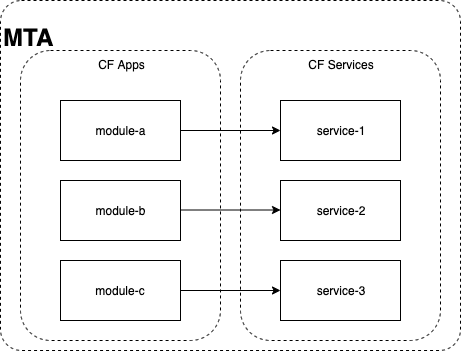

:toc:

# Partial deployment

Partial deployment is a feature allowing fine control over which parts of the MTA will get processed by the SAP Cloud Deployment service.
With this feature you can choose to deploy only certain module(s) and/or resource(s). The SAP Cloud Deployment service then orchestrates the deployment only for the selected parts while ignoring the rest.

WARNING: All descriptor validations and dependency checks on the processed modules are always executed. If the MTA archive is invalid or, for example, a module has a missing dependency (i.e. service instance which it should be bound to but does not exist), the deployment fails. 

## Usage
To use this feature, pass one of the following environment variablest to the `cf deploy` or `cf bg-deploy commands`:

|===
|-m <module name>|
Deploy only the module with the specified name.
Note: It can be used multiple times. Also this way you will upload all the resources from the descriptor.
|--all-modules|
Deploy all modules.
|-r <resource name>|
Deploy only the resource with the specified name
Note:It can be used multiple times. Also this way you will upload all the modules from the descriptor.
|--all-resources|
Deploy all resources.ß
|===

## Partial build & assembly

Only selected modules would be built and included in the MTA archive. This optimizes built & assembly time, the archive size and respectively the upload & processing time in the SAP Cloud Deployment service.

### Partial build

If you only maintain a design time descriptor for your project or module - the `mta.yaml` file, it needs to be built before you can deploy it using partial deployment commands. In order to prepare the required artifacts, which include the build results for the modules and the deployment descriptor, or the `mtad.yaml` file, you can use link:https://sap.github.io/cloud-mta-build-tool/usage/#auxiliary-commands[the auxiliary commands of the Cloud MTA archive builder].

You can find a few tips about usage of the Cloud MTA Builder commands for the partial build in the "Build only specific MTA modules defined in the `mta.yaml` file and deploy them" section below.

### Partial assembly
If initiated from a `mtad.yaml`, the `cf deploy` command is capable of assembling an MTA archive just before deployment. The list of modules passed to the `(bg-)deploy` command is used to determine which would be included in the assembled archive.

NOTE: For the assembly to work properly, it's necessary to maintain the `path` argument in the modules. All selected modules should have this `path` argument pointing to the appropriate module bits.

## Partial deploy

In the current directory you'll find an example Cloud Foundry app payload with the following structure:



* development descriptor: link:mta.yaml[mta.yaml]
* deployment descriptor: link:mtad.yaml[mtad.yaml]


## Official Documentation
* SAP Help Portal: link:https://help.sap.com/viewer/65de2977205c403bbc107264b8eccf4b/Cloud/en-US/65ddb1b51a0642148c6b468a759a8a2e.html[Multitarget Application Commands for the Cloud Foundry Environment]

# Try it out

## Deploy directly from directory, via `mtad.yaml`

In the current directory, run the command `cf deploy -m module-b -r service-2`. This will automatically assemble an MTA archive and deploy it:

```bash
$ cf deploy -m module-b -r service-2
Deploying multi-target app archive */mta-examples/hello-world.mtar in org ******** / space ******** as **** ...
Uploading 1 files...
  */mta-examples/hello-world.mtar
OK
...
No deployed MTA detected - this is initial deployment
Processing service "service-2"...
Creating service "service-2" from MTA resource "service-2"...
Creating application "module-b" from MTA module "module-b"...
Uploading application "module-b"...
Scaling application "module-b" to "1" instances...
Staging application "module-b"...
Application "module-b" staged
Starting application "module-b"..
Application "module-b" started and available at "******-*-module-b.cfapps.sap.hana.ondemand.com"
Skipping deletion of services, because the command line option "--delete-services" is not specified.
Process finished.
```
## Assemble an MTA archive via `mtad.yaml` and deploy it

First run the command `mbt assemble` to create the MTAR archive:

```bash
$ mbt assemble
  INFO assembling the MTA project...
  INFO copying the MTA content...
  INFO generating the metadata...
  INFO generating the MTA archive...
  INFO the MTA archive generated at: /Users/i076083/git/mta_examples/partial-build-deploy/mta_archives/hello-world_1.0.0.mtar
  INFO cleaning temporary files...
```

Then deploy the assembled MTAR archive:

```bash
$ cf deploy mta_archives/hello-world_1.0.0.mtar -m module-c -r service-3
  ...
```

NOTE: This approach is less efficient, as all modules are included in the MTA archive and uploaded to the SAP Cloud Deployment service, while only the selected ones are processed.

## Build only specific MTA modules defined in the `mta.yaml` file and deploy them

NOTE: Since partial deployment requires all the modules' and resources' dependencies to be resolved, we recommend that you first build and deploy the complete MTA project (using the `mbt build` command to create the MTA archive (`mtar`) file and the `cf deploy` command to deploy it) and then build and deploy only the changing modules.

The command for building specific modules using the Cloud MTA Builder Tool is:

```bash
$ mbt module-build -m=<list of modules to build> [options]`
```

NOTE: We recommend that you always apply the `-g` option that also generates the deployment descriptor - the `mtad.yaml` file. The `path` property for the selected deployable modules in this `mtad.yaml` will point to the build results of these modules, so you will be able to immediately run the partial deployment command as described in the "Deploy directly from directory via mtad.yaml" section.

In the examples below we demonstrate how to use the partial build command in different use cases. These examples are based on the project structure described above and this link:mta.yaml[mta.yaml] file.

### Building a single independent module

```bash
$ mbt module-build -m module-b -g
```

### Buiding several independent modules

```bash
$ mbt module-build -m module-b,module-c -g
```

### Buiding a module with build dependencies

Build dependencies are defined via the `requires` property of the `build-parameters` section in the `mta.yaml` file. You can find more information link:https://sap.github.io/cloud-mta-build-tool/configuration/#configuring-build-order[here].

In the sample project, `module-a` depends on modules `module-b` and `module-c`.

You can build the `module-a` module with all its dependencies using the following command:

```bash
$ mbt module-build -m module-a -a -g
```

The `module-b` and `module-c` modules will be built before the tool builds the `module-a` module.

If you now change the `module-b` module and would like to re-build and re-deploy the `module-a` module, use the following command:

```bash
$ mbt module-build -m module-a,module-b -g
```

The tool will build the specified modules only in the correct order.

You can find the complete information about the Cloud MTA Build Tools partial build options link:https://sap.github.io/cloud-mta-build-tool/usage/#auxiliary-commands[here].

Once you have your modules built and the `mtad.yaml` file generated, you can use the partial deployment command as described in the "Deploy directly from directory via mtad.yaml" section.

NOTE: If you expect to redeploy MTA modules/resources multiple times e.g. when doing minor adjustments to them - it may make sense to do a full deployment once and later only update the modules/resources you want. 

## Clean up resources
It is recommended to stop or undeploy your MTAs when they are no longer needed. In order to do so, run the following command:
``` bash
$ cf undeploy <mta-id> -f --delete-services
```

