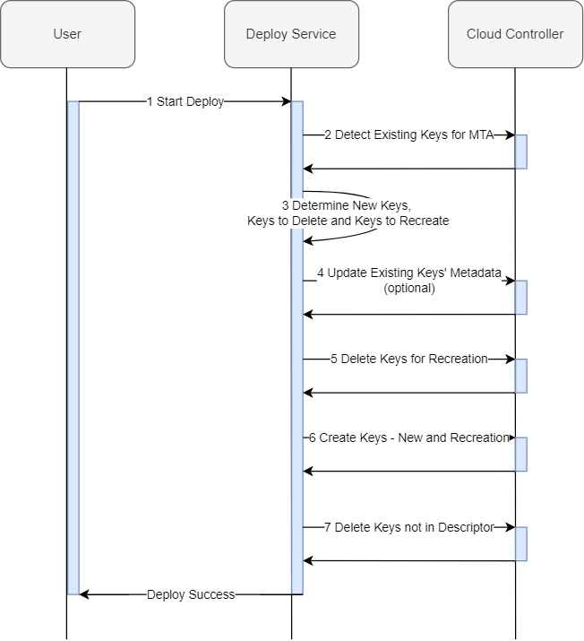

:toc:

# Automatic Service Key Renewal

## Overview

It's a common use case to want an automatic service key renewal (e.g. if you want to rotate generated service credentials or certificates). Service key renewal on MTA redeployment is supported by using changed key names. You can do this either by manually changing the service key name in the descriptor or by using a dynamic parameter as part of it - ${timestamp}. This parameter will always resolve to the current timestamp at the time of deployment. This means that the key will have a different name on each subsequent deployment. This ensures that it will be considered as new and created. Afterwards the old key will be deleted. This functionality applies to service keys modelled under a resource using the `service-keys:` parameter. Example descriptor for automated key renewal/rotation:

```yaml
...
resources:
  - name: my-service
    type: org.cloudfoundry.managed-service
    parameters:
      service-plan: plan
      service: offering
      service-keys:
        - name: my-rotating-key-${timestamp}
...
```

## Detailed Service Key Renewal Process

During deployment, any service keys that are modelled in the MTA descriptor but don't exist in the space we're deploying to are created. MTA service keys that exist but are not modelled in the current descriptor - are considered no longer in use and deleted afterwards. These keys are identified as part of the MTA by their metadata (applied to service keys during the MTA deployment process).

This is an overview of the service key renewal process:



Step by step explanation:

1. A user starts a deploy for a previously deployed MTA. The mtad.yaml descriptor contains resources with `service-keys` definitions
2. Deploy Service detects the existing services and service keys part of the MTA that already exist in the target space and org via their names and metadata
3. Deploy Service resolves all parameters in the descriptor (including the system parameter `${timestamp}`) and gathers the service key definitions for the current deployment. These are then compared to the existing ones detected in the previous step - any defined keys not present are marked for *creation*, any defined keys that are present but in a failed state (determined by last operation state from CF != "succeeded")  or have different credentials are marked for *recreation*, any keys that are present but are not defined are marked for *deletion*
4. Deploy Service updates the metadata of any present service keys if necessary (e.g. the key was created previously for a different MTA or without metadata)
5. Deploy Service deletes the service keys marked for recreation in step 3
6. Deploy Service creates new service keys - the ones marked for creation and the ones deleted in the previous step
7. Deploy Service deletes the service keys marked for deletion in step 3

The service keys using the `${timestamp}` parameter in their names are in this case are simply considered as new service keys - meaning they are created at step *6* and then after that the old ones are deleted in step *7* (since they are no longer present in the descriptor with the updated names). This ensures the rotating keys are first created and bound before the old ones are deleted (as seen from above this isn't true for the keys that require recreation due to a failed state or credential change, as their names are the same and cannot be recreated before the old ones are deleted).

## Automatically Renewed Service Key Consumption
To consume a service key with a changing name in an application environment, make sure to use the parameter `env-var-name` when defining the service key `requires` section in the consuming module. This will ensure that the service key details are persisted under a static alias in the application environment. e.g.

```yaml
modules:
- name: my-app
...
  requires:
    - name: rotating-key
      parameters:
        env-var-name: *keycredentials*
...
resources:
  - name: my-service
    type: org.cloudfoundry.managed-service
    parameters:
      service-keys:
        - name: rotating-key-${timestamp}
  - name: rotating-key
    type: org.cloudfoundry.existing-service-key
    parameters:
      service-name: my-service
      service-key-name: rotating-key-${timestamp}
```
link:https://help.sap.com/docs/btp/sap-business-technology-platform/service-keys#consumption-of-service-keys[More details about this parameter here.]


## Try it out

Deploy the provided mtar in cf to demo the automated service key rotation
```bash
cf deploy ./test-rotating-service-keys.mtar
```

Verify the service key with a dynamic name was created, and added to the app environment
```bash
cf service-keys postgre-test-service
...
cf service-key postgre-test-service <rotating-key-1-timestamp-1>
...
cf env my-app
...
```

Do a redeploy of the same mta (observe the messages in the process log), e.g.
```bash
cf deploy ./test-rotating-service-keys.mtar
...
Creating service key "<rotating-key-1-timestamp-2>" for service instance "postgre-test-service"...
...
Deleting service key "<rotating-key-1-timestamp-1>" for service instance "postgre-test-service"...
...
```

Verify that the new service key was created and the old one deleted
```bash
cf service-keys postgre-test-service
...
cf service-key postgre-test-service <rotating-key-1-timestamp-2>
...
cf env my-app
...
```

## Official related documentation in Help SAP Portal

- link:https://help.sap.com/docs/btp/sap-business-technology-platform/service-keys[MTA Service Keys Official Documentation]
